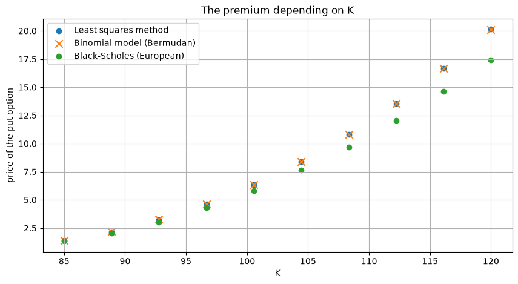
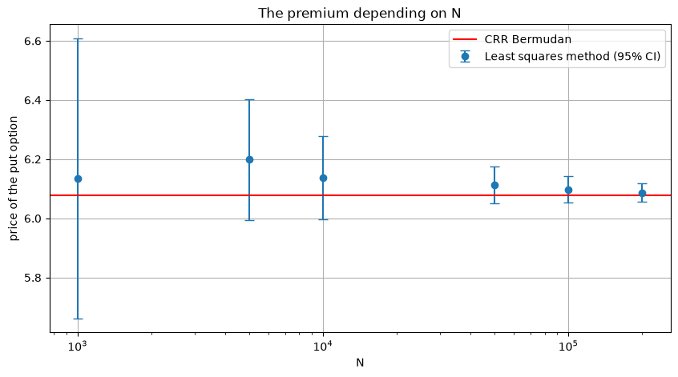
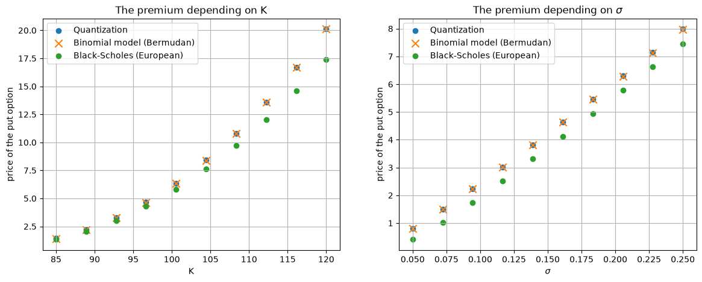
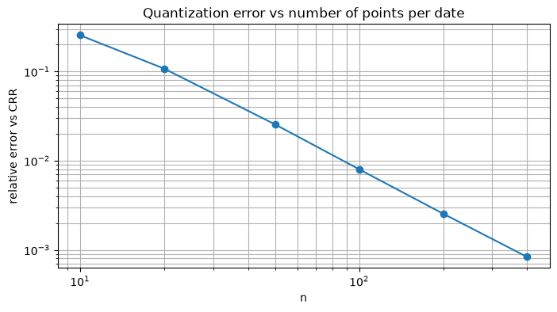

# American-Option-Pricing

# Summary

This repository contains a comprehensive analysis and implementation of various methods for pricing American options. The project is designed to provide a clear understanding of American option pricing mechanisms and to implement these using mathematical and computational techniques.

## Table of Contents

- [Introduction](#introduction)
- [Methods](#methods)
- [Usage](#usage)
- [Results](#results)
- [Corrections](#corrections)

## Introduction

American options are financial derivatives that give the holder the right to exercise the option at any time before or at the expiration date. This flexibility makes American options more complex to price than European options, as they require consideration of optimal exercise strategies.

This project explores different methods to price American options, comparing their efficiency, accuracy, and computational demands.

## Methods

The repository implements and analyzes the following pricing methods:

1. **Binomial Trees** (Cox-Ross-Rubinstein): European, American and Bermudan versions, used as the benchmark.
2. **Quantization Tree** (Bally-Pagès): each date is split into equally likely cells, with exact transition probabilities between cells.
3. **Least Squares Monte Carlo** (Longstaff-Schwartz): regression of the continuation value on Laguerre polynomials of S/K, on in-the-money paths.

All pricers live in [`pricing.py`](pricing.py); the notebooks run the studies.

Each method includes explanations, code implementations, and analysis of its advantages and disadvantages.

## Usage

Requirements: `numpy`, `scipy`, `matplotlib` (and Jupyter to run the notebooks).

- **Binomial Trees**: Run the notebook `Binomial_tree.ipynb`
- **Discretization Method**: Run the notebook `DiscretisationVF.ipynb`
- **Monte Carlo Simulation**: Run the notebook `Monte_carlo.ipynb`

Each notebook includes configurable parameters for option characteristics and simulation details. Adjust these parameters as needed.

## Results

Put option, S0 = 100, σ = 20%, r = 5%, T = 1 year, 50 exercise dates. Reference: Bermudan CRR tree with the same exercise dates (5,000 steps).

| Method | Price (K = 100) | Error vs CRR | Over K ∈ [85, 120] | Over σ ∈ [5%, 25%] | Time |
|---|---|---|---|---|---|
| CRR Bermudan (benchmark) | 6.0785 | – | – | – | < 1 s |
| LSM, 100k paths, m = 4 Laguerre | 6.0974 ± 0.0227 | +0.31% | max 0.79% | max 0.44% | 0.4 s |
| Quantization, 200 points/date | 6.0940 | +0.25% | max 2.39% (deep OTM, K = 85) | max 0.26% | ~15 s |
| European (Black-Scholes) | 5.5735 | – | – | – | – |

- **Validation of LSM against Longstaff & Schwartz (2001), Table 1**: within 0.4% of the CRR benchmark on all six cases tested (e.g. S0 = 36, σ = 20%, T = 1: 4.4751 ± 0.0093 vs 4.478 in the paper).
- **Early-exercise premium** captured: 6.08 (Bermudan) vs 5.57 (European) at the money.
- **Quantization** converges to the benchmark as the grid is refined: error +10.8% (20 points), +2.6% (50), +0.8% (100), +0.25% (200), +0.08% (400). The error is largest for deep out-of-the-money puts, where equally likely cells are coarse in the tail.
- **LSM basis size**: m = 1 → −8.2%, m = 2 → −1.2%, m ≥ 3 → within Monte Carlo error.

### Least Squares Monte Carlo vs benchmark

The LSM price matches the Bermudan CRR tree across strikes, and sits above the European price (early-exercise premium):

Convergence in the number of paths N (95% confidence intervals):

### Quantization tree vs benchmark

The relative error decreases steadily as the grid is refined:

